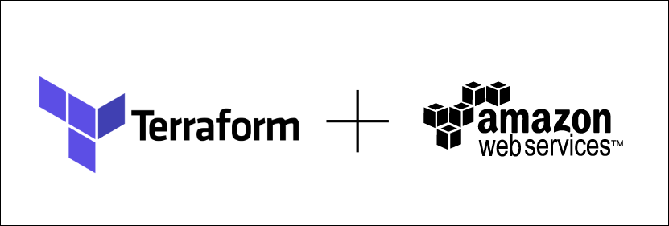

# **CRYSTAL-SERVER**
Crystal Report Server on AWS using Terraform



# **Install required tools using Home brew and Pip**
## **Install Terraform**
```
brew install terraform
terraform --version
```

## **Terraform Project Files**
- **asg.tf:** Auto Scaling Group resources and data content
- **cloudwatch.tf:** AWS Cloud watch resources and data content.
- **iam.tf:** Identity and Access Management (IAM) resources and data content
- **main.tf:** AWS EC2 resources and data content
- **output.tf:** Output variables for resources that are being deployed
- **README.md:** Markdown file for documentation
- **sg.tf:** Security Group (SG) resources and data content
- **terraform.tfvars:** Override value for all variables
- **variables.tf:** Variable being passed in for all .tf files for better management with default values
- **version.tf:** Terraform Version. Minimum required 0.12 to use this tutorial.

# *****NOTES:*** 
- Cloud watch and Auto Scaling Group (ASG) configuration with Launch Template will help scaling Crystal Report instances elastically as needed. 
- Cloud watch also important for Monitoring of Crystal EC2 Instances.
- Identity and Access Management (IAM) and Security Groups (SG) will help in securing infrastructure in terms of what is exposed and how to communicate with services deployed on Crystal EC2 instances once it is deployed.


## **Terraform Lifecycle**
**Init → Plan → Apply → Destroy**
- **Init:** Initialize a Terraform working directory
```
terraform init
```
- **Plan:** Generate and show an execution plan
```
terraform plan
```
- **Apply:** Builds or changes infrastructure
```
terraform apply
```
- **Destroy:** Destroy Terraform-managed infrastructure
```
terraform destroy
```

## **Set Appropriate value for all variables through terraform.tfvars**


# **Resources**
* [HashiCorp Terraform](https://www.terraform.io)